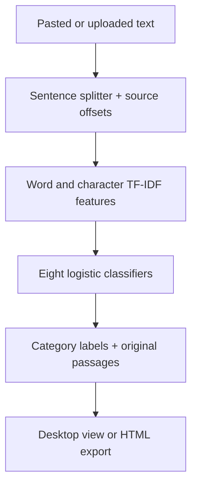

# ClauseGuard: implementation and explanation

## The project in one sentence

We help people locate potentially concerning categories in English Terms of Service, inspect the original passage and complete a specific reading task faster than manual reading alone.

## End-to-end pipeline

No external LLM/API is called. A sentence may receive more than one label. Fixed category explanations describe the label concept; they are not generated legal advice.

## Code map

| File | What it does | Why it matters |
|---|---|---|
| `app.py` | Tk input, analysis, filters, source highlighting and export | A person can operate a running product |
| `clauses/text.py` | Split sentences while keeping exact character offsets | A label can be checked against the original text |
| `clauses/data.py` | Fetch/check the pinned archive; read official splits | Reproducible data and company-separated development |
| `clauses/model.py` | Train, load, save, predict and select label thresholds | This is the team's explainable traditional NLP core |
| `clauses/evaluate.py` | F1, per-category scores, exact match and prediction exports | Baseline comparisons and honest error analysis |
| `clauses/export.py` | Escape supplied text and render self-contained HTML | Inspectable output without remote services |
| `clauses/cli.py` | User commands for analysis, training, evaluation and records | Reproducible operation even without a desktop display |
| `clauses/study.py` | Validate anonymous task records; summarize success | Actual product outcome, distinct from model accuracy |
| `clauses/task_timer.py` | Time a real user task and save its answer/notes | Contemporaneous evidence for the weekly report |
| `scripts/verify_sep22.py` | Run tests, validation, error counts and demo checks | One command reproduces today's technical evidence |
| `scripts/finalize_session04.py` | Merge supplied real facts and task metrics into the report | Avoid hand-calculation errors without inventing events |
| `scripts/validate_submission.py` | Check course filename, headings, names and unresolved fields | Catch mechanical submission mistakes |

## Models and training

**Training:** 5,532 sentences from 30 companies. **Validation:** 2,275 sentences from 10 different companies. **Reserved test:** 1,607 sentences; not evaluated here. These are fixed UNFAIR-ToS/LexGLUE splits, not a random sentence split that could mix a company's clauses between train and validation.

- **Baseline:** word-unigram TF-IDF and eight one-vs-rest logistic-regression classifiers.
- **Balanced:** word unigrams/bigrams with class-weighted logistic regression.
- **Hybrid (selected):** balanced word features plus character n-grams of length 3–5. Character fragments can share evidence across wording variants.

Training uses seed 641, regularization `C=1`, liblinear and up to 1,000 iterations. Labels are predicted when their model score is **strictly greater than 0.5**. No threshold tuning is claimed for this release. Character/word vocabulary sizes and other parameters are in `clauses/model.py`; installed package versions are pinned.

Eight labels: limitation of liability; unilateral termination; unilateral change; content removal; contract by using; choice of law; jurisdiction; arbitration. This release does **not** implement data-selling detection, cookie-consent assessment or enforceability judgments.

The selected artifact was originally generated September 10 and re-evaluated September 22. Selection used validation macro F1 over the eight target categories. Validation is therefore a development set, not an unbiased final estimate. Keep the test evaluation for a frozen later model.

## Actual September 22 results

| Model | Macro F1, 8 categories | Micro F1, 8 categories | Macro F1, 9 including no-category | Micro F1, 9 |
|---|---:|---:|---:|---:|
| Baseline | 0.2551 | 0.3300 | 0.3331 | 0.9153 |
| Balanced | 0.6156 | 0.6084 | 0.6540 | 0.9107 |
| Hybrid, shipped artifact candidate | 0.6333 | 0.6275 | 0.6695 | 0.9126 |

All F1 values use a 0–1 scale. They are measured comparisons on the same validation set, **not three weeks of progress**. Raw values and predictions are in `experiments/session04/`.

Macro F1 averages each category's F1 equally. Micro F1 pools category decisions. The nine-label convention derives a “no category” label when no target label applies. There are 2,045 no-category sentences out of 2,275 validation sentences: this majority can make aggregate accuracy look good while rare categories fail.

The hybrid improves eight-category macro F1 by **0.3782** over baseline, but its nine-label micro F1 is **0.0027 lower**. State that tradeoff plainly. There is no course-mandated passing F1 threshold and no guarantee that improvements will occur every week. Use your reproduced baseline as the direct comparison; published LexGLUE results require matching split, label convention and experimental settings before comparison.

## Concrete errors worth explaining

- Arbitration: precision 0.2273, recall 0.5556, F1 0.3226; only 9 positive validation examples, with 17 false positives and 4 false negatives.
- Unilateral change: 34 false positives and 7 false negatives; broad update wording needs error inspection.
- No-category majority: hybrid exact match 0.9081 is lower than baseline 0.9178, despite better category macro F1.

Error IDs are in `experiments/session04/error_analysis.json`; prediction scores and gold/predicted labels are in `hybrid/predictions.jsonl`. To inspect original text locally after downloading data, match those IDs against `load_split('validation')`. These counts identify failure patterns; they do not by themselves establish their linguistic causes.

## Product metric and costs

North-star: percentage of recorded ClauseGuard tasks that are correct within 180 seconds, with denominators and participant counts. F1 measures category prediction; task success measures whether a person benefits. Neither alone establishes legal correctness.

Inference uses local CPU and no metered API, so the application makes no per-call API charge. Hardware, electricity, installation time and support still have costs. Today's measured batch timing is in `hybrid/metrics.json`; it is not end-to-end GUI latency or a hosting cost estimate.

## Known limits

Older English ToS and their annotation context may not generalize to current services or other jurisdictions/languages. Class weighting trades precision for recall. Scores are uncalibrated. Rule-based splitting may mishandle unusual formatting. Input is UTF-8 text, not PDF/OCR, with a 100,000-character cap. No flag means no category exceeded the threshold, not “safe.” User study fixtures are short and fictional. The GUI was not visually exercised in the headless build environment.

## Likely professor questions

| Question | Defensible answer |
|---|---|
| Why is this NLP rather than a wrapper? | We train/evaluate feature extractors and eight supervised classifiers, preserve source text and analyze actual prediction errors. |
| Why use a simple model? | It runs locally, is reproducible, easy to explain, and establishes a baseline before spending time on larger models. |
| Why not call accuracy the main metric? | Most sentences have no target category; macro F1 reveals rare-category failures. |
| Did your model beat all baselines? | It wins on our category macro-F1 selection metric and loses slightly on nine-label micro F1 and exact match. |
| Is the held-out result a final test result? | No. It is validation used for development/selection. Test evaluation remains reserved. |
| Are these labels legal conclusions? | No. They are source-derived review categories, with the text shown for inspection. |
| What did real users do? | Answer only from the actual committed task records; until collected, say the pilot is incomplete. |
| What did each member write? | Point to actual issue-linked approved PRs and explain the code personally; do not attribute generated work retroactively. |
